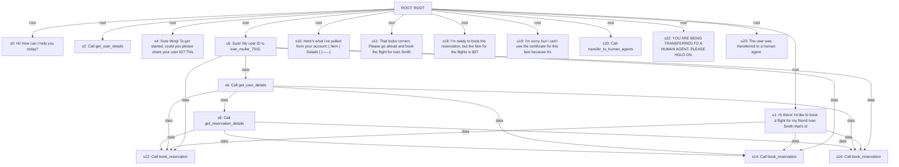
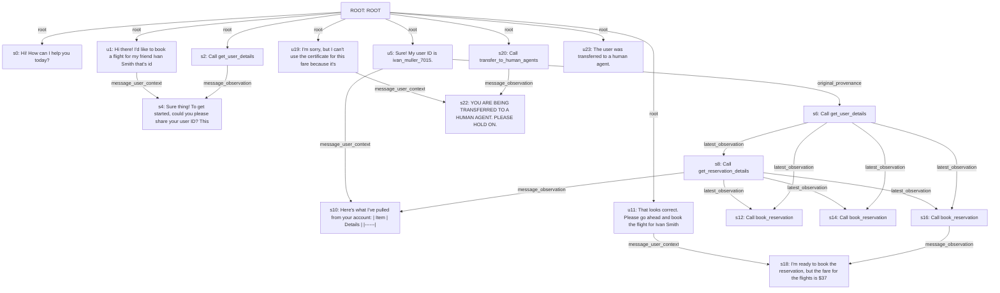

# Task 25, failed run 51d355a9-07ea-4032-9dd7-4899b68598fc

## Original graph

```mermaid
flowchart TD
  v0["ROOT: ROOT"]
  v1["s0: Hi! How can I help you today?"]
  v2["u1: Hi there! I'd like to book a flight for my friend Ivan Smith that's id"]
  v3["s2: Call get_user_details"]
  v4["s4: Sure thing! To get started, could you please share your user ID? This "]
  v5["u5: Sure! My user ID is ivan_muller_7015."]
  v6["s6: Call get_user_details"]
  v7["s8: Call get_reservation_details"]
  v8["s10: Here's what I've pulled from your account: | Item | Details | |------|"]
  v9["u11: That looks correct. Please go ahead and book the flight for Ivan Smith"]
  v10["s12: Call book_reservation"]
  v11["s14: Call book_reservation"]
  v12["s16: Call book_reservation"]
  v13["s18: I'm ready to book the reservation, but the fare for the flights is $37"]
  v14["u19: I'm sorry, but I can't use the certificate for this fare because it's "]
  v15["s20: Call transfer_to_human_agents"]
  v16["s22: YOU ARE BEING TRANSFERRED TO A HUMAN AGENT. PLEASE HOLD ON."]
  v17["u23: The user was transferred to a human agent."]
  v0 -->|"root"| v1
  v0 -->|"root"| v2
  v0 -->|"root"| v3
  v0 -->|"root"| v4
  v0 -->|"root"| v5
  v5 -->|"data"| v6
  v6 -->|"data"| v7
  v0 -->|"root"| v8
  v0 -->|"root"| v9
  v7 -->|"data"| v10
  v6 -->|"data"| v10
  v2 -->|"data"| v10
  v5 -->|"data"| v10
  v7 -->|"data"| v11
  v6 -->|"data"| v11
  v2 -->|"data"| v11
  v5 -->|"data"| v11
  v7 -->|"data"| v12
  v6 -->|"data"| v12
  v2 -->|"data"| v12
  v5 -->|"data"| v12
  v0 -->|"root"| v13
  v0 -->|"root"| v14
  v0 -->|"root"| v15
  v0 -->|"root"| v16
  v0 -->|"root"| v17
```

## State/context graph ablation

```mermaid
flowchart TD
  v0["ROOT: ROOT"]
  v1["s0: Hi! How can I help you today?"]
  v2["u1: Hi there! I'd like to book a flight for my friend Ivan Smith that's id"]
  v3["s2: Call get_user_details"]
  v4["s4: Sure thing! To get started, could you please share your user ID? This "]
  v5["u5: Sure! My user ID is ivan_muller_7015."]
  v6["s6: Call get_user_details"]
  v7["s8: Call get_reservation_details"]
  v8["s10: Here's what I've pulled from your account: | Item | Details | |------|"]
  v9["u11: That looks correct. Please go ahead and book the flight for Ivan Smith"]
  v10["s12: Call book_reservation"]
  v11["s14: Call book_reservation"]
  v12["s16: Call book_reservation"]
  v13["s18: I'm ready to book the reservation, but the fare for the flights is $37"]
  v14["u19: I'm sorry, but I can't use the certificate for this fare because it's "]
  v15["s20: Call transfer_to_human_agents"]
  v16["s22: YOU ARE BEING TRANSFERRED TO A HUMAN AGENT. PLEASE HOLD ON."]
  v17["u23: The user was transferred to a human agent."]
  v0 -->|"root"| v1
  v0 -->|"root"| v2
  v0 -->|"root"| v3
  v2 -->|"message_user_context"| v4
  v3 -->|"message_observation"| v4
  v0 -->|"root"| v5
  v5 -->|"original_provenance"| v6
  v6 -->|"latest_observation"| v7
  v5 -->|"message_user_context"| v8
  v7 -->|"message_observation"| v8
  v0 -->|"root"| v9
  v7 -->|"latest_observation"| v10
  v6 -->|"latest_observation"| v10
  v7 -->|"latest_observation"| v11
  v6 -->|"latest_observation"| v11
  v7 -->|"latest_observation"| v12
  v6 -->|"latest_observation"| v12
  v9 -->|"message_user_context"| v13
  v12 -->|"message_observation"| v13
  v0 -->|"root"| v14
  v0 -->|"root"| v15
  v14 -->|"message_user_context"| v16
  v15 -->|"message_observation"| v16
  v0 -->|"root"| v17
```
