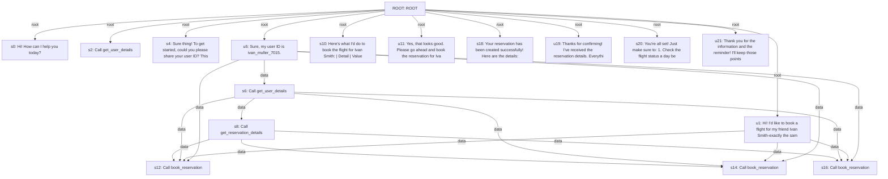
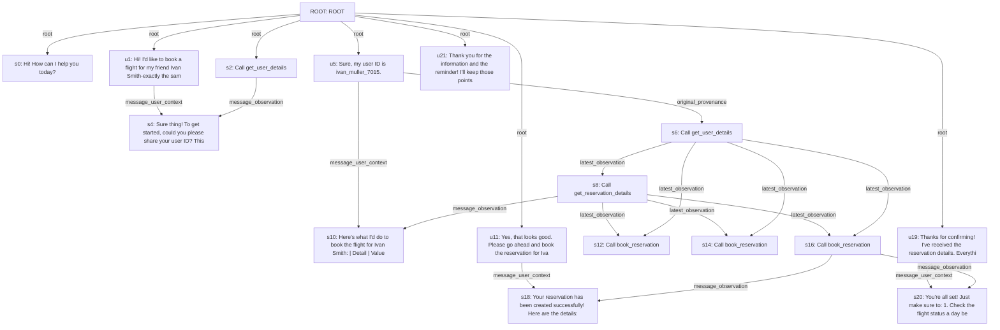

# Task 25, successful run 0f0f7358-e7dc-439c-87e5-5389c81f6d8d

## Original graph

```mermaid
flowchart TD
  v0["ROOT: ROOT"]
  v1["s0: Hi! How can I help you today?"]
  v2["u1: Hi! I'd like to book a flight for my friend Ivan Smith-exactly the sam"]
  v3["s2: Call get_user_details"]
  v4["s4: Sure thing! To get started, could you please share your user ID? This "]
  v5["u5: Sure, my user ID is ivan_muller_7015."]
  v6["s6: Call get_user_details"]
  v7["s8: Call get_reservation_details"]
  v8["s10: Here's what I'd do to book the flight for Ivan Smith: | Detail | Value"]
  v9["u11: Yes, that looks good. Please go ahead and book the reservation for Iva"]
  v10["s12: Call book_reservation"]
  v11["s14: Call book_reservation"]
  v12["s16: Call book_reservation"]
  v13["s18: Your reservation has been created successfully! Here are the details: "]
  v14["u19: Thanks for confirming! I've received the reservation details. Everythi"]
  v15["s20: You're all set! Just make sure to: 1. Check the flight status a day be"]
  v16["u21: Thank you for the information and the reminder! I'll keep those points"]
  v0 -->|"root"| v1
  v0 -->|"root"| v2
  v0 -->|"root"| v3
  v0 -->|"root"| v4
  v0 -->|"root"| v5
  v5 -->|"data"| v6
  v6 -->|"data"| v7
  v0 -->|"root"| v8
  v0 -->|"root"| v9
  v7 -->|"data"| v10
  v6 -->|"data"| v10
  v2 -->|"data"| v10
  v5 -->|"data"| v10
  v7 -->|"data"| v11
  v6 -->|"data"| v11
  v2 -->|"data"| v11
  v5 -->|"data"| v11
  v7 -->|"data"| v12
  v6 -->|"data"| v12
  v2 -->|"data"| v12
  v5 -->|"data"| v12
  v0 -->|"root"| v13
  v0 -->|"root"| v14
  v0 -->|"root"| v15
  v0 -->|"root"| v16
```

## State/context graph ablation

```mermaid
flowchart TD
  v0["ROOT: ROOT"]
  v1["s0: Hi! How can I help you today?"]
  v2["u1: Hi! I'd like to book a flight for my friend Ivan Smith-exactly the sam"]
  v3["s2: Call get_user_details"]
  v4["s4: Sure thing! To get started, could you please share your user ID? This "]
  v5["u5: Sure, my user ID is ivan_muller_7015."]
  v6["s6: Call get_user_details"]
  v7["s8: Call get_reservation_details"]
  v8["s10: Here's what I'd do to book the flight for Ivan Smith: | Detail | Value"]
  v9["u11: Yes, that looks good. Please go ahead and book the reservation for Iva"]
  v10["s12: Call book_reservation"]
  v11["s14: Call book_reservation"]
  v12["s16: Call book_reservation"]
  v13["s18: Your reservation has been created successfully! Here are the details: "]
  v14["u19: Thanks for confirming! I've received the reservation details. Everythi"]
  v15["s20: You're all set! Just make sure to: 1. Check the flight status a day be"]
  v16["u21: Thank you for the information and the reminder! I'll keep those points"]
  v0 -->|"root"| v1
  v0 -->|"root"| v2
  v0 -->|"root"| v3
  v2 -->|"message_user_context"| v4
  v3 -->|"message_observation"| v4
  v0 -->|"root"| v5
  v5 -->|"original_provenance"| v6
  v6 -->|"latest_observation"| v7
  v5 -->|"message_user_context"| v8
  v7 -->|"message_observation"| v8
  v0 -->|"root"| v9
  v7 -->|"latest_observation"| v10
  v6 -->|"latest_observation"| v10
  v7 -->|"latest_observation"| v11
  v6 -->|"latest_observation"| v11
  v7 -->|"latest_observation"| v12
  v6 -->|"latest_observation"| v12
  v9 -->|"message_user_context"| v13
  v12 -->|"message_observation"| v13
  v0 -->|"root"| v14
  v14 -->|"message_user_context"| v15
  v12 -->|"message_observation"| v15
  v0 -->|"root"| v16
```
