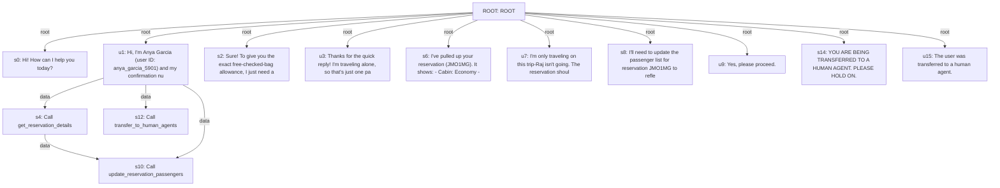
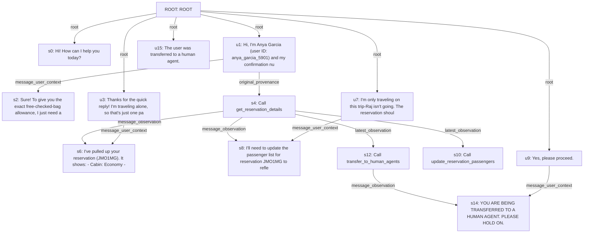

# Task 3, failed run 2710c03e-b9d8-460e-93dc-38b6ed24b221

## Original graph

```mermaid
flowchart TD
  v0["ROOT: ROOT"]
  v1["s0: Hi! How can I help you today?"]
  v2["u1: Hi, I'm Anya Garcia (user ID: anya_garcia_5901) and my confirmation nu"]
  v3["s2: Sure! To give you the exact free-checked-bag allowance, I just need a "]
  v4["u3: Thanks for the quick reply! I'm traveling alone, so that's just one pa"]
  v5["s4: Call get_reservation_details"]
  v6["s6: I've pulled up your reservation (JMO1MG). It shows: - Cabin: Economy -"]
  v7["u7: I'm only traveling on this trip-Raj isn't going. The reservation shoul"]
  v8["s8: I'll need to update the passenger list for reservation JMO1MG to refle"]
  v9["u9: Yes, please proceed."]
  v10["s10: Call update_reservation_passengers"]
  v11["s12: Call transfer_to_human_agents"]
  v12["s14: YOU ARE BEING TRANSFERRED TO A HUMAN AGENT. PLEASE HOLD ON."]
  v13["u15: The user was transferred to a human agent."]
  v0 -->|"root"| v1
  v0 -->|"root"| v2
  v0 -->|"root"| v3
  v0 -->|"root"| v4
  v2 -->|"data"| v5
  v0 -->|"root"| v6
  v0 -->|"root"| v7
  v0 -->|"root"| v8
  v0 -->|"root"| v9
  v5 -->|"data"| v10
  v2 -->|"data"| v10
  v2 -->|"data"| v11
  v0 -->|"root"| v12
  v0 -->|"root"| v13
```

## State/context graph ablation

```mermaid
flowchart TD
  v0["ROOT: ROOT"]
  v1["s0: Hi! How can I help you today?"]
  v2["u1: Hi, I'm Anya Garcia (user ID: anya_garcia_5901) and my confirmation nu"]
  v3["s2: Sure! To give you the exact free-checked-bag allowance, I just need a "]
  v4["u3: Thanks for the quick reply! I'm traveling alone, so that's just one pa"]
  v5["s4: Call get_reservation_details"]
  v6["s6: I've pulled up your reservation (JMO1MG). It shows: - Cabin: Economy -"]
  v7["u7: I'm only traveling on this trip-Raj isn't going. The reservation shoul"]
  v8["s8: I'll need to update the passenger list for reservation JMO1MG to refle"]
  v9["u9: Yes, please proceed."]
  v10["s10: Call update_reservation_passengers"]
  v11["s12: Call transfer_to_human_agents"]
  v12["s14: YOU ARE BEING TRANSFERRED TO A HUMAN AGENT. PLEASE HOLD ON."]
  v13["u15: The user was transferred to a human agent."]
  v0 -->|"root"| v1
  v0 -->|"root"| v2
  v2 -->|"message_user_context"| v3
  v0 -->|"root"| v4
  v2 -->|"original_provenance"| v5
  v4 -->|"message_user_context"| v6
  v5 -->|"message_observation"| v6
  v0 -->|"root"| v7
  v7 -->|"message_user_context"| v8
  v5 -->|"message_observation"| v8
  v0 -->|"root"| v9
  v5 -->|"latest_observation"| v10
  v5 -->|"latest_observation"| v11
  v9 -->|"message_user_context"| v12
  v11 -->|"message_observation"| v12
  v0 -->|"root"| v13
```
