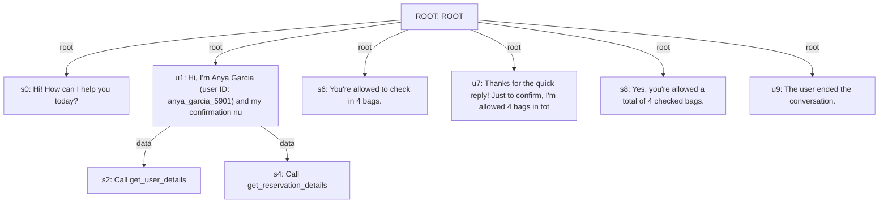
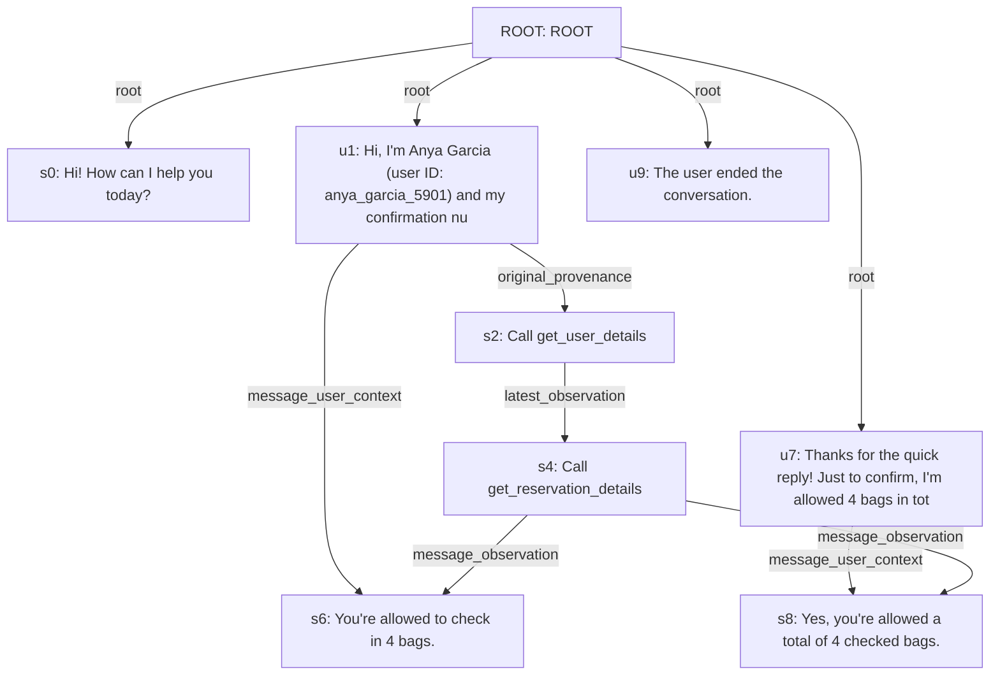

# Task 3, successful run 0ab1d7a2-dcd2-4f0c-addd-bb0af1d97111

## Original graph

```mermaid
flowchart TD
  v0["ROOT: ROOT"]
  v1["s0: Hi! How can I help you today?"]
  v2["u1: Hi, I'm Anya Garcia (user ID: anya_garcia_5901) and my confirmation nu"]
  v3["s2: Call get_user_details"]
  v4["s4: Call get_reservation_details"]
  v5["s6: You're allowed to check in 4 bags."]
  v6["u7: Thanks for the quick reply! Just to confirm, I'm allowed 4 bags in tot"]
  v7["s8: Yes, you're allowed a total of 4 checked bags."]
  v8["u9: The user ended the conversation."]
  v0 -->|"root"| v1
  v0 -->|"root"| v2
  v2 -->|"data"| v3
  v2 -->|"data"| v4
  v0 -->|"root"| v5
  v0 -->|"root"| v6
  v0 -->|"root"| v7
  v0 -->|"root"| v8
```

## State/context graph ablation

```mermaid
flowchart TD
  v0["ROOT: ROOT"]
  v1["s0: Hi! How can I help you today?"]
  v2["u1: Hi, I'm Anya Garcia (user ID: anya_garcia_5901) and my confirmation nu"]
  v3["s2: Call get_user_details"]
  v4["s4: Call get_reservation_details"]
  v5["s6: You're allowed to check in 4 bags."]
  v6["u7: Thanks for the quick reply! Just to confirm, I'm allowed 4 bags in tot"]
  v7["s8: Yes, you're allowed a total of 4 checked bags."]
  v8["u9: The user ended the conversation."]
  v0 -->|"root"| v1
  v0 -->|"root"| v2
  v2 -->|"original_provenance"| v3
  v3 -->|"latest_observation"| v4
  v2 -->|"message_user_context"| v5
  v4 -->|"message_observation"| v5
  v0 -->|"root"| v6
  v6 -->|"message_user_context"| v7
  v4 -->|"message_observation"| v7
  v0 -->|"root"| v8
```
