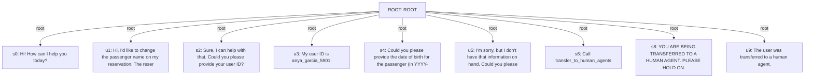
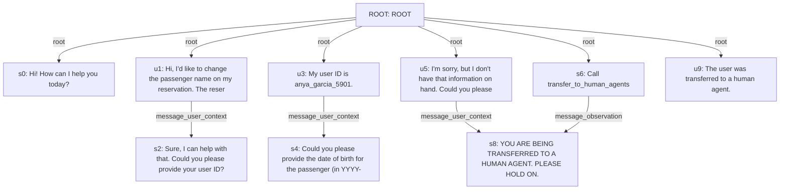

# Task 40, failed run 13e45831-b7be-4614-9556-35e4cea713f3

## Original graph

```mermaid
flowchart TD
  v0["ROOT: ROOT"]
  v1["s0: Hi! How can I help you today?"]
  v2["u1: Hi, I'd like to change the passenger name on my reservation. The reser"]
  v3["s2: Sure, I can help with that. Could you please provide your user ID?"]
  v4["u3: My user ID is anya_garcia_5901."]
  v5["s4: Could you please provide the date of birth for the passenger (in YYYY-"]
  v6["u5: I'm sorry, but I don't have that information on hand. Could you please"]
  v7["s6: Call transfer_to_human_agents"]
  v8["s8: YOU ARE BEING TRANSFERRED TO A HUMAN AGENT. PLEASE HOLD ON."]
  v9["u9: The user was transferred to a human agent."]
  v0 -->|"root"| v1
  v0 -->|"root"| v2
  v0 -->|"root"| v3
  v0 -->|"root"| v4
  v0 -->|"root"| v5
  v0 -->|"root"| v6
  v0 -->|"root"| v7
  v0 -->|"root"| v8
  v0 -->|"root"| v9
```

## State/context graph ablation

```mermaid
flowchart TD
  v0["ROOT: ROOT"]
  v1["s0: Hi! How can I help you today?"]
  v2["u1: Hi, I'd like to change the passenger name on my reservation. The reser"]
  v3["s2: Sure, I can help with that. Could you please provide your user ID?"]
  v4["u3: My user ID is anya_garcia_5901."]
  v5["s4: Could you please provide the date of birth for the passenger (in YYYY-"]
  v6["u5: I'm sorry, but I don't have that information on hand. Could you please"]
  v7["s6: Call transfer_to_human_agents"]
  v8["s8: YOU ARE BEING TRANSFERRED TO A HUMAN AGENT. PLEASE HOLD ON."]
  v9["u9: The user was transferred to a human agent."]
  v0 -->|"root"| v1
  v0 -->|"root"| v2
  v2 -->|"message_user_context"| v3
  v0 -->|"root"| v4
  v4 -->|"message_user_context"| v5
  v0 -->|"root"| v6
  v0 -->|"root"| v7
  v6 -->|"message_user_context"| v8
  v7 -->|"message_observation"| v8
  v0 -->|"root"| v9
```
