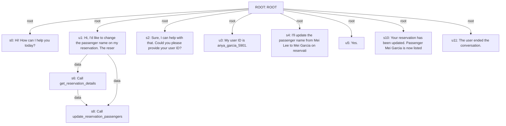
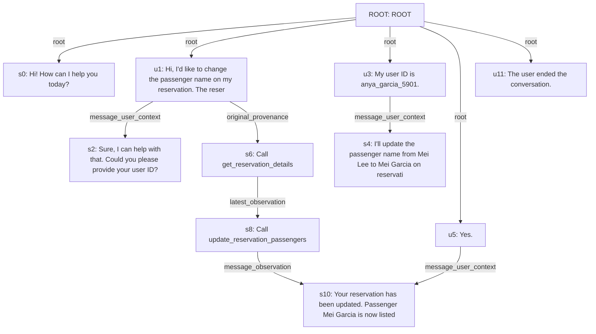

# Task 40, successful run 3d7bf865-b14e-4676-9735-c0431cd77e03

## Original graph

```mermaid
flowchart TD
  v0["ROOT: ROOT"]
  v1["s0: Hi! How can I help you today?"]
  v2["u1: Hi, I'd like to change the passenger name on my reservation. The reser"]
  v3["s2: Sure, I can help with that. Could you please provide your user ID?"]
  v4["u3: My user ID is anya_garcia_5901."]
  v5["s4: I'll update the passenger name from Mei Lee to Mei Garcia on reservati"]
  v6["u5: Yes."]
  v7["s6: Call get_reservation_details"]
  v8["s8: Call update_reservation_passengers"]
  v9["s10: Your reservation has been updated. Passenger Mei Garcia is now listed "]
  v10["u11: The user ended the conversation."]
  v0 -->|"root"| v1
  v0 -->|"root"| v2
  v0 -->|"root"| v3
  v0 -->|"root"| v4
  v0 -->|"root"| v5
  v0 -->|"root"| v6
  v2 -->|"data"| v7
  v7 -->|"data"| v8
  v2 -->|"data"| v8
  v0 -->|"root"| v9
  v0 -->|"root"| v10
```

## State/context graph ablation

```mermaid
flowchart TD
  v0["ROOT: ROOT"]
  v1["s0: Hi! How can I help you today?"]
  v2["u1: Hi, I'd like to change the passenger name on my reservation. The reser"]
  v3["s2: Sure, I can help with that. Could you please provide your user ID?"]
  v4["u3: My user ID is anya_garcia_5901."]
  v5["s4: I'll update the passenger name from Mei Lee to Mei Garcia on reservati"]
  v6["u5: Yes."]
  v7["s6: Call get_reservation_details"]
  v8["s8: Call update_reservation_passengers"]
  v9["s10: Your reservation has been updated. Passenger Mei Garcia is now listed "]
  v10["u11: The user ended the conversation."]
  v0 -->|"root"| v1
  v0 -->|"root"| v2
  v2 -->|"message_user_context"| v3
  v0 -->|"root"| v4
  v4 -->|"message_user_context"| v5
  v0 -->|"root"| v6
  v2 -->|"original_provenance"| v7
  v7 -->|"latest_observation"| v8
  v6 -->|"message_user_context"| v9
  v8 -->|"message_observation"| v9
  v0 -->|"root"| v10
```
