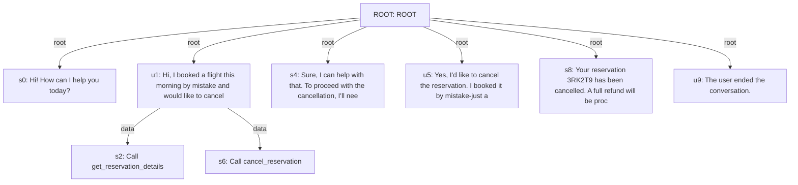
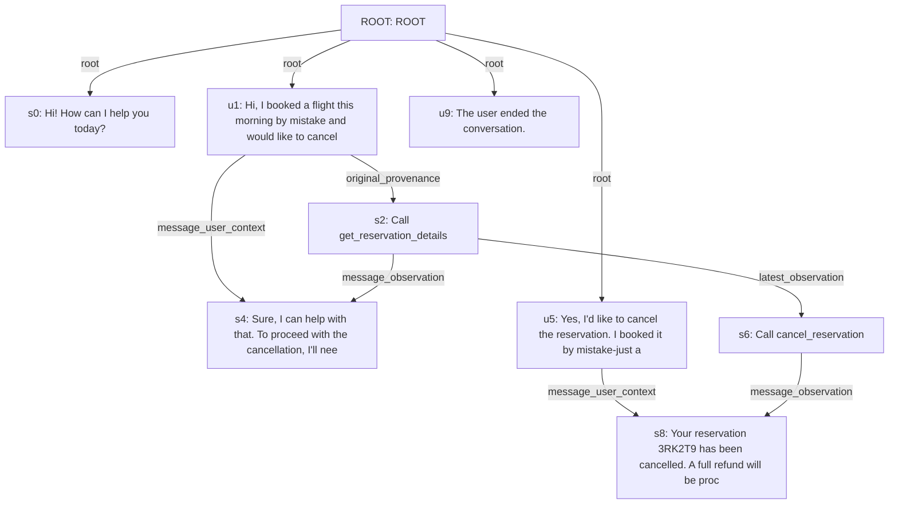

# Task 48, failed run 058388c8-f730-4850-bf5a-5c24b600620e

## Original graph

```mermaid
flowchart TD
  v0["ROOT: ROOT"]
  v1["s0: Hi! How can I help you today?"]
  v2["u1: Hi, I booked a flight this morning by mistake and would like to cancel"]
  v3["s2: Call get_reservation_details"]
  v4["s4: Sure, I can help with that. To proceed with the cancellation, I'll nee"]
  v5["u5: Yes, I'd like to cancel the reservation. I booked it by mistake-just a"]
  v6["s6: Call cancel_reservation"]
  v7["s8: Your reservation 3RK2T9 has been cancelled. A full refund will be proc"]
  v8["u9: The user ended the conversation."]
  v0 -->|"root"| v1
  v0 -->|"root"| v2
  v2 -->|"data"| v3
  v0 -->|"root"| v4
  v0 -->|"root"| v5
  v2 -->|"data"| v6
  v0 -->|"root"| v7
  v0 -->|"root"| v8
```

## State/context graph ablation

```mermaid
flowchart TD
  v0["ROOT: ROOT"]
  v1["s0: Hi! How can I help you today?"]
  v2["u1: Hi, I booked a flight this morning by mistake and would like to cancel"]
  v3["s2: Call get_reservation_details"]
  v4["s4: Sure, I can help with that. To proceed with the cancellation, I'll nee"]
  v5["u5: Yes, I'd like to cancel the reservation. I booked it by mistake-just a"]
  v6["s6: Call cancel_reservation"]
  v7["s8: Your reservation 3RK2T9 has been cancelled. A full refund will be proc"]
  v8["u9: The user ended the conversation."]
  v0 -->|"root"| v1
  v0 -->|"root"| v2
  v2 -->|"original_provenance"| v3
  v2 -->|"message_user_context"| v4
  v3 -->|"message_observation"| v4
  v0 -->|"root"| v5
  v3 -->|"latest_observation"| v6
  v5 -->|"message_user_context"| v7
  v6 -->|"message_observation"| v7
  v0 -->|"root"| v8
```
