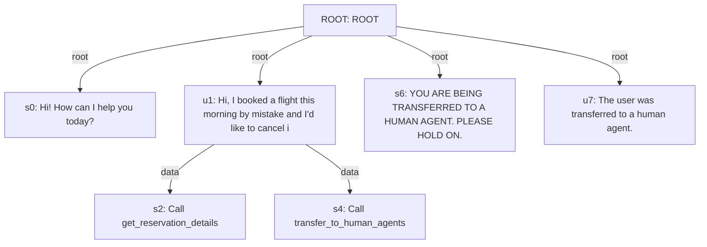
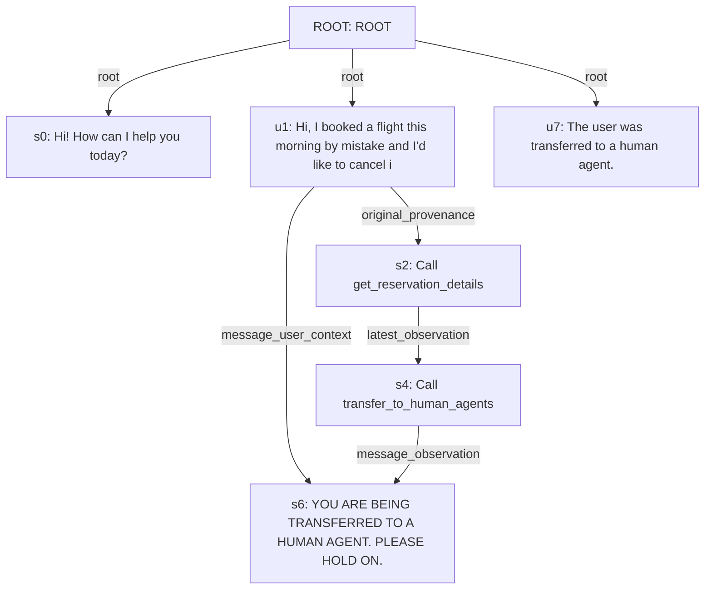

# Task 48, successful run 07ec0bf6-3138-439c-b9d2-b434abbea422

## Original graph

```mermaid
flowchart TD
  v0["ROOT: ROOT"]
  v1["s0: Hi! How can I help you today?"]
  v2["u1: Hi, I booked a flight this morning by mistake and I'd like to cancel i"]
  v3["s2: Call get_reservation_details"]
  v4["s4: Call transfer_to_human_agents"]
  v5["s6: YOU ARE BEING TRANSFERRED TO A HUMAN AGENT. PLEASE HOLD ON."]
  v6["u7: The user was transferred to a human agent."]
  v0 -->|"root"| v1
  v0 -->|"root"| v2
  v2 -->|"data"| v3
  v2 -->|"data"| v4
  v0 -->|"root"| v5
  v0 -->|"root"| v6
```

## State/context graph ablation

```mermaid
flowchart TD
  v0["ROOT: ROOT"]
  v1["s0: Hi! How can I help you today?"]
  v2["u1: Hi, I booked a flight this morning by mistake and I'd like to cancel i"]
  v3["s2: Call get_reservation_details"]
  v4["s4: Call transfer_to_human_agents"]
  v5["s6: YOU ARE BEING TRANSFERRED TO A HUMAN AGENT. PLEASE HOLD ON."]
  v6["u7: The user was transferred to a human agent."]
  v0 -->|"root"| v1
  v0 -->|"root"| v2
  v2 -->|"original_provenance"| v3
  v3 -->|"latest_observation"| v4
  v2 -->|"message_user_context"| v5
  v4 -->|"message_observation"| v5
  v0 -->|"root"| v6
```
